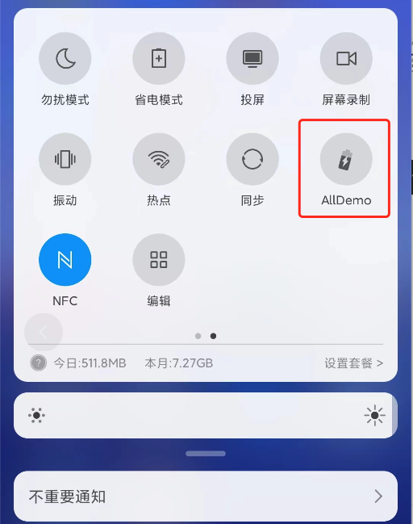

# QUICKENTER

## 功能介绍
实现菜单栏快捷入口功能
如下图所示，实现快速APP的快捷入口。

## DEMO介绍
本demo主要实现三个流程来实现的：
1.注册一个QuickSettingService类，继承自TileService，具体参照<a href="https://github.com/aa5279aa/android_all_demo/tree/master/DemoClient/READMELIST#README_JVMTI">QuickSettingService</a>
2.Mainfest中进行注册，具体参照<a href="https://github.com/aa5279aa/android_all_demo/tree/master/DemoClient/READMELIST#README_JVMTI">QuickSettingService</a>
3.安装APP。安装了之后，只是APP进行了申请，支持快捷栏入口，具体快捷栏是否展示，还是要通过手机快捷栏进行配置的。

## 备注

## 更新记录；
2022.10.28:更新readme

  

